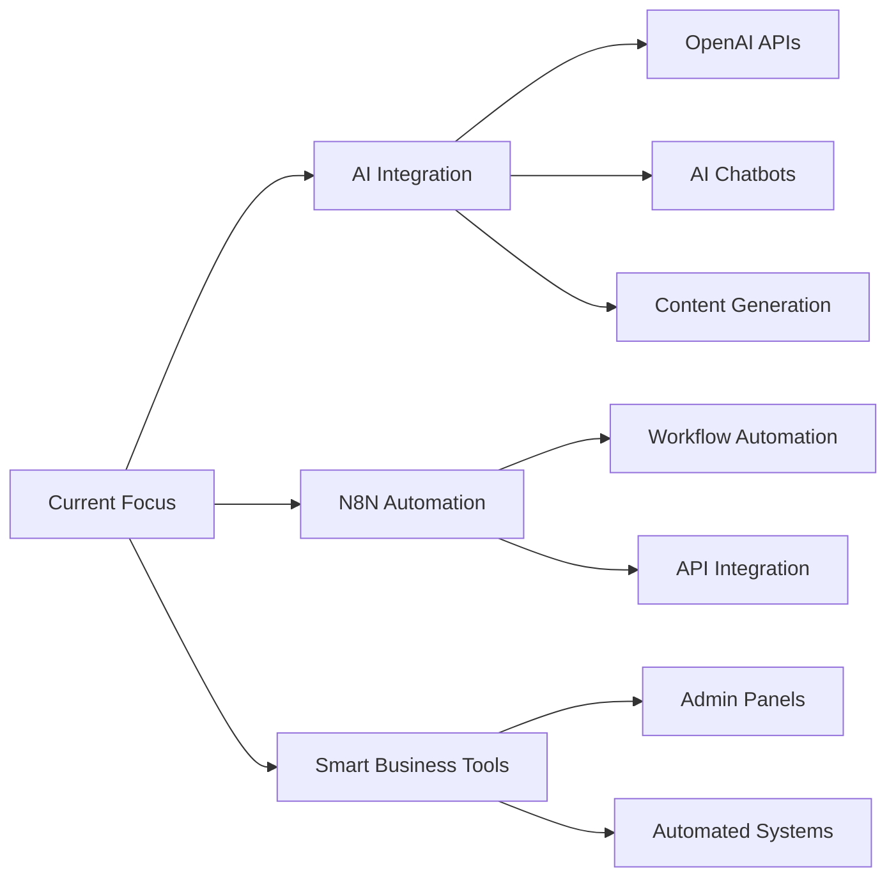

<div align="center">

<!-- Animated Header with Gradient -->


<!-- Profile badges -->
<p align="center">
  <a href="https://www.linkedin.com/in/kareem-tarek123"></a>
  <a href="mailto:KKAREEMTAREK2@GMAIL.COM"></a>
  
  
  
</p>

<!-- Animated Typing -->
<p align="center">
  <a href="https://git.io/typing-svg">
    
  </a>
</p>

</div>

<!-- Gradient Divider -->
<p align="center">
  
</p>

<!-- About Me Section -->
<table align="center">
<tr>
<td width="50%">

## 🚀 About Me

```typescript
interface Developer {
  name: string;
  role: string;
  location: string;
  specialties: string[];
  currentlyLearning: string;
  expertise: string[];
}

const kareemTarek: Developer = {
  name: "Kareem Tarek",
  role: "Frontend Developer & Automation Specialist",
  location: "Egypt 🇪🇬",
  specialties: [
    "⚛️ React & Next.js Applications",
    "🤖 N8N Workflow Automation",
    "🎨 Responsive UI/UX Design",
    "🧠 AI-Powered Web Solutions",
    "📱 Progressive Web Apps"
  ],
  currentlyLearning: "AI Integration & Smart Tools",
  expertise: [
    "Building automated workflows",
    "Integrating AI into websites",
    "Creating intelligent business tools"
  ]
};
```

</td>
<td width="50%">


</td>
</tr>
</table>

<!-- New Specialization Section -->
<h2 align="center">🎯 Current Specialization</h2>

<div align="center">

### 🤖 Automation & AI Integration

I specialize in **N8N automation** and creating **AI-powered tools** that make websites smarter and businesses more efficient!

<table>
<tr>
<td width="50%">

#### 🔧 What I Do:
- ⚡ **N8N Automation Workflows**
  - Custom business process automation
  - API integrations & data synchronization
  - Automated notifications & alerts
  
- 🧠 **AI-Powered Features**
  - Smart chatbots & assistants
  - Content generation tools
  - Intelligent data processing
  
- 🎨 **Business Solutions**
  - Easy-to-use admin panels
  - Automated reporting systems
  - Smart form processing

</td>
<td width="50%">

#### 📚 Currently Learning:
- 🤖 Advanced AI integration techniques
- 🌐 Building AI-enhanced websites
- 🛠️ Creating smart business tools
- 🔗 Connecting AI APIs to frontend
- 📊 AI-powered analytics dashboards

#### 💡 My Goal:
> Making complex business logic simple and accessible through intelligent automation and AI-powered tools

</td>
</tr>
</table>

</div>

<!-- Quick Stats Overview -->
<h2 align="center">📊 Quick Stats Overview</h2>

<p align="center">
  
  
</p>

<!-- Languages & Tools Section -->
<h2 align="center">💻 Technologies & Tools</h2>

<details open>
<summary><b>🎨 Frontend Technologies</b></summary>
<br>
<p align="center">
  
  
  
  
  
  
  
  
  
  
</p>
</details>

<details open>
<summary><b>🤖 Automation & AI</b></summary>
<br>
<p align="center">
  
  
  
  
  
  
</p>
</details>

<details open>
<summary><b>⚙️ Backend & Database</b></summary>
<br>
<p align="center">
  
  
  
  
  
  
</p>
</details>

<details open>
<summary><b>🛠️ Tools & Platforms</b></summary>
<br>
<p align="center">
  
  
  
  
  
  
  
</p>
</details>

<!-- GitHub Activity Graph -->
<h2 align="center">📈 Contribution Activity</h2>

<p align="center">
  
</p>

<!-- Language Stats -->
<h2 align="center">📊 Language Statistics</h2>

<p align="center">
  
</p>

<!-- Profile Summary Cards -->
<h2 align="center">💳 GitHub Profile Summary</h2>

<p align="center">
  
</p>

<p align="center">
  
  
  
</p>

<!-- Trophies -->
<h2 align="center">🏆 GitHub Achievements</h2>

<p align="center">
  
</p>


<!-- Current Focus -->
<h2 align="center">🎯 Current Focus & Learning Path</h2>

<div align="center">



</div>

<!-- What I'm Building -->
<h2 align="center">🛠️ What I'm Building</h2>

<div align="center">

<table>
<tr>
<td width="33%" align="center">

### 🤖 AI Tools
Smart features that make websites intelligent and user-friendly

</td>
<td width="33%" align="center">

### ⚡ Automation Workflows
N8N workflows that simplify complex business processes

</td>
<td width="33%" align="center">

### 🎨 Business Solutions
Easy-to-use tools that handle any business logic efficiently

</td>
</tr>
</table>

</div>

<!-- Quote -->
<h2 align="center">💡 Philosophy</h2>

<p align="center">
  
</p>

<p align="center">
  <i>"Making technology work for businesses, not the other way around"</i>
</p>

<!-- Connect Section -->
<h2 align="center">🤝 Let's Connect!</h2>

<div align="center">
  
  <p>
    <i>Looking to automate your business or add AI-powered features to your website?</i><br>
    <i>Let's collaborate and build something amazing together!</i>
  </p>
  
  <a href="https://www.linkedin.com/in/kareem-tarek123">
    
  </a>
  <a href="mailto:KKAREEMTAREK2@GMAIL.COM">
    
  </a>
  <a href="https://github.com/kkareemtarek2014">
    
  </a>
  
  <br><br>
  
  
  
  
</div>

<!-- Footer -->
<p align="center">
  
</p>

<h3 align="center">
  <i>⚡ "Automation is not about replacing humans, it's about empowering them"</i>
</h3>

<p align="center">
  <i>Made with ❤️ and automated with 🤖 by <b>Kareem Tarek</b></i>
  <br>
  <i>© 2024 All rights reserved</i>
</p>
