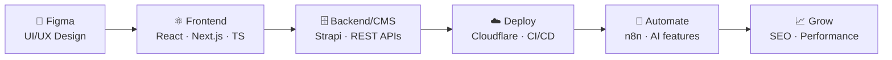

<div align="center">

<!-- ═══════════════════════ HERO ═══════════════════════ -->


<a href="https://git.io/typing-svg">
  
</a>

<br/>

<a href="https://my-profile.kkareemtarek2.workers.dev/"></a>
<a href="https://www.linkedin.com/in/kareem-tarek123"></a>
<a href="mailto:kkareemtarek2@gmail.com"></a>
<a href="https://wa.me/201090313619"></a>


</div>


<!-- ═══════════════════════ PITCH ═══════════════════════ -->

## ⚡ The 10-Second Pitch

> **They call me "the builder of websites."** I take a Figma file and turn it into something fast, alive, and pixel-perfect — e-commerce, booking platforms, marketplaces, corporate sites. From Cairo to Canada, if it needs to feel expensive, **I build it.**

<div align="center">

| 🌐 **21** | 🗓️ **3.5+** | 🌍 **2** | 🎯 **∞** |
|:---:|:---:|:---:|:---:|
| live production websites | years of experience | countries shipped to | pixels obsessed over |

</div>

You've probably used something I built without knowing it — the websites of **Mountain View**, **El Gouna**, **MG Motor Egypt**, **Go Bus**, and **Abu Auf** all came through my keyboard.

<!-- ═══════════════════════ AI EDGE ═══════════════════════ -->

## 🧠 Why I'm Different: AI Speed × Real Experience

Most developers fall into one of two camps. I'm the third.

```typescript
const marketToday = {
  juniors_with_AI:  "Ship fast, but can't tell 'looks done' from 'is done'",
  seniors_without:  "Deep knowledge, but ship at 2021 speed",

  kareem: {
    foundation: "3.5+ years hand-writing production frontend — BEFORE AI wrote its first <div>",
    today:      "AI-powered workflow: I ship in days what used to take weeks",
    the_edge:   "When AI output breaks at 2am, I know exactly WHY — and how to fix it",
  },
} as const;
```

I use AI daily as a **power tool, not a crutch** — grounded in a knowledge base built the hard way: architecture decisions, performance budgets, accessibility, SEO structure, security, and browser quirks. That's what turns AI speed into production quality.

<!-- ═══════════════════════ BUILDER ═══════════════════════ -->

## 🏗️ One Person, Full Pipeline

I don't just write components — **I build entire websites myself, end to end**, and learn something new every single day.


```mermaid
graph LR
    A["🎨 Figma<br/>UI/UX Design"] --> B["⚛️ Frontend<br/>React · Next.js · TS"]
    B --> C["🗄️ Backend/CMS<br/>Strapi · REST APIs"]
    C --> D["☁️ Deploy<br/>Cloudflare · CI/CD"]
    D --> E["🤖 Automate<br/>n8n · AI features"]
    E --> F["📈 Grow<br/>SEO · Performance"]
```

<div align="center">

| 🎨 Design | ⚛️ Build | 🚀 Ship | 🤖 Automate |
|:---|:---|:---|:---|
| UI/UX from scratch in Figma — wireframes, design systems, prototypes | Pixel-perfect, multilingual (AR/EN), SEO-ready frontends | Server setup, Cloudflare, CloudPanel, CI/CD — I handle launch myself | n8n workflows, AI chatbots, smart business tools |

</div>

<!-- ═══════════════════════ WORK ═══════════════════════ -->

## 🏆 Selected Live Work

Every single one is **live in production right now** — click and see.

<div align="center">

| Brand | What It Is | Scale |
|:---|:---|:---|
| 🏝️ [**El Gouna**](https://www.elgouna.com/) | Orascom's Red Sea destination platform — hotels, events, real estate | Multilingual · multi-currency |
| 🏙️ [**Mountain View**](https://www.mountainviewegypt.com/) | Corporate platform for one of Egypt's largest real-estate developers | 23+ luxury communities |
| 🚌 [**Go Bus**](https://go-bus.com/?lang=en) | Booking platform for Egypt's largest intercity bus operator | Trip search + seat reservation |
| 🚗 [**MG Motor Egypt**](https://www.mgmotor.com.eg/) | Official MG cars website — model showcases, comparison tool | Video-driven experience |
| ☕ [**Abu Auf**](https://www.abuauf.com/) | E-commerce for Egypt's leading coffee & healthy-foods brand | 175+ branches |
| 🍰 [**Salé Sucré**](https://www.salesucre.com/) | Luxury patisserie e-commerce with custom cake ordering | 40+ branches · delivery zones |
| 🍬 [**Koueider**](https://www.koueider.com/) | Bilingual e-commerce for the historic sweets brand | Est. 1930 · 30+ branches |
| 🇨🇦 [**BizGenie**](https://bizgenie.ca/) | Canadian freelance marketplace — listings, talent search, courses | Full client/freelancer flows |
| 🚘 [**Ecral**](https://www.ecral.com/) | Car rental & chauffeur booking platform | AR/EN · corporate services |
| 🥐 [**La Poire Group**](https://lapoire-group.com/) | Corporate site for the F&B group behind La Poire & Beano's | Brand + franchising |

**➕ 11 more live sites** — [see the full portfolio ↗](https://my-profile.kkareemtarek2.workers.dev/#work)

</div>

<!-- ═══════════════════════ STACK ═══════════════════════ -->

## 🛠️ The Arsenal

<div align="center">

**Core — used in production every day**

     

**Design → Backend → Deploy**

      

**Automation & AI**

   

</div>

<!-- ═══════════════════════ EXPERIENCE ═══════════════════════ -->

## 💼 Where I Build

| | Role | Highlights |
|:---|:---|:---|
| 🏢 | **[MitchDesigns](https://www.mitchdesigns.com/)** — Frontend Developer *(Full-time, 2023–now)* | Core frontend dev at one of Egypt's leading web agencies — 15+ live sites for major brands |
| 🌐 | **[CRUX International](https://cruxafc.com/)** — Frontend Developer *(Part-time, 2025–now)* | Built the corporate site end-to-end + BizGenie, a Canadian marketplace platform |
| 🚀 | **Freelance** *(2023–now)* | Full lifecycle ownership: Figma → build → CMS → hosting → launch, for clients in Egypt & abroad |

<!-- ═══════════════════════ STATS ═══════════════════════ -->

## 📊 GitHub Pulse

<div align="center">


</div>

<!-- ═══════════════════════ HIRE ═══════════════════════ -->

## 🤝 Hiring? Here's Why It's Me

- 🎯 **Proof, not promises** — 21 live production websites you can click right now, built for brands people actually know.
- ⚡ **Speed with a safety net** — AI-accelerated delivery on top of 3.5+ years of hard-earned frontend depth.
- 🧩 **One accountable person** — design, frontend, backend, deployment, automation. No hand-offs, no gaps.
- 📈 **Business-first mindset** — every build targets one goal: make your brand bigger and your business more profitable.
- 📚 **Never standing still** — I learn something new every day and put it into production the next.

<div align="center">

### Let's build something great.

<a href="https://my-profile.kkareemtarek2.workers.dev/contact"></a>
<a href="https://wa.me/201090313619"></a>

*Full-time / part-time: available after a 1-month notice period · Freelance: can start right away*


**build. animate. ship. repeat.**

</div>
